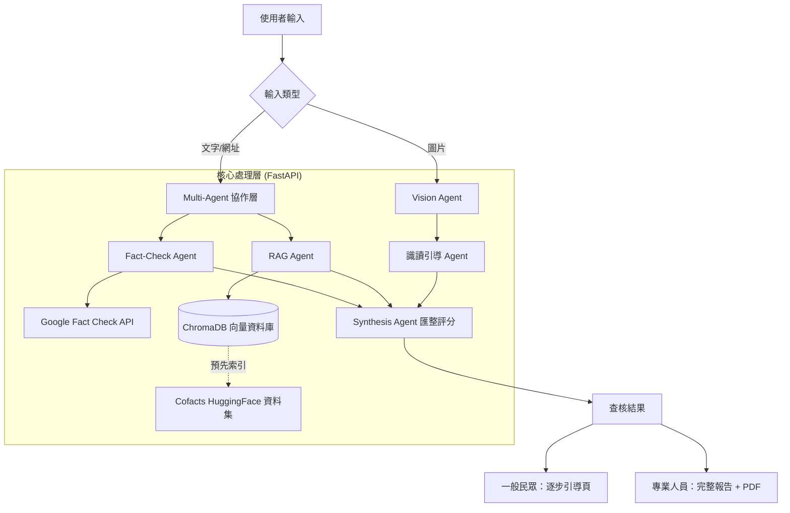

# 假訊息情報中心 — 完整規劃與技術實作指南

> 版本：Final | 最後更新：2026-04-10

---

## 1. 專案定位

一個假訊息查核與媒體識讀工具，主要服務一般民眾，專業人員（館員、研究者、記者）也能使用。

**核心差異化：**
- 不只告訴你真假，還教你怎麼判斷（教學導向）
- 現有工具只處理文字謠言，本工具也處理 AI 生成圖片（填補缺口）
- 引入 RAG 架構，確保查核結果基於 Cofacts 真實事實資料庫，減少 AI 幻覺

**面試時回答「跟 Cofacts 有什麼不一樣」：**
- Cofacts 給你答案，這個工具給你能力
- Cofacts 依賴社群人工回報，這個工具是 AI 即時分析
- Cofacts 處理文字謠言，這個工具也處理 AI 生成圖片

---

## 2. 使用對象

- **主要**：一般民眾（想查核可疑訊息的人）
- **次要**：專業人員（圖書館員、研究者、媒體工作者）

---

## 3. 輸入形式

- 文字訊息
- 網址
- 圖片（含 AI 生成辨識）
- 影片（未來擴充，v2）

---

## 4. 核心功能

### 一般民眾模式

逐步引導推論，教學式查核流程：

1. 使用者輸入可疑訊息／網址／圖片
2. 系統自動跑查核步驟（步驟式）
   - 檢查網址來源
   - 分析資訊來源可信度
   - RAG 比對 Cofacts 歷史查核記錄（HuggingFace 資料集）
   - 跨平台查核比對（Google Fact Check）
   - AI 生成內容辨識（圖片輸入時）
3. 使用者可針對任一步驟追問（對話式）
4. 最終輸出查核結果：
   - 可信度評分與標籤（假訊息 / 待查證 / 可信）
   - AI 摘要說明
   - AI 生成可能性分析（圖片輸入時）
   - 識讀小撇步（幫助使用者下次獨立判斷）
   - 相關查核來源連結

### 專業人員模式

跳過逐步引導，直接產出完整分析報告：

**報告內容：**
- 基本資訊（查核時間、輸入內容截圖）
- 可信度評分與標籤
- 逐項分析（網址、來源、內容、圖片）
- RAG 比對結果（相似歷史查核案例，來源：Cofacts HuggingFace 資料集）
- 跨平台查核比對（Google Fact Check）
- AI 綜合判斷（評分依據、關鍵線索、不確定之處）
- AI 生成內容辨識結果與判斷依據（圖片輸入時）
- 參考來源清單

**輸出格式：**
- PDF 下載
- 可分享連結

### 儀表板

- 假訊息分類統計（政治、財金、健康、社會等）
- 近期趨勢圖（Chart.js）
- 資料來源：Cofacts HuggingFace 公開資料集

---

## 5. 技術架構

### 5.1 系統架構圖



### 5.2 技術選型

| 層級 | 技術 | 說明 |
|------|------|------|
| 前端 | HTML + JavaScript + Chart.js | 儀表板圖表 |
| 後端 | Python FastAPI | 非同步 API 框架 |
| AI 主模型 | Gemini 2.0 Flash | 分析、摘要、評分、對話、圖片辨識 |
| Embedding | all-MiniLM-L6-v2（開源） | 不需額外 API key，pip install sentence-transformers |
| 向量資料庫 | ChromaDB | 輕量，支援本地與容器部署 |
| UI 設計 | Google Stitch | UI 原型與設計稿 |
| 部署 | Zeabur | 需掛載持久化 Volume 給 ChromaDB |

---

## 6. 核心技術實作

### 6.1 RAG 實作路徑

目的：避免 LLM 幻覺，確保查核結果基於 Cofacts 真實事實資料。

1. **資料預處理**：下載 Cofacts HuggingFace 資料集（JSON/CSV），保留 `text`、`reply`、`category` 欄位並清洗
2. **向量化 (Embedding)**：使用開源 `all-MiniLM-L6-v2`（`sentence-transformers`），無需額外 API key
3. **存儲 (Vector DB)**：ChromaDB `PersistentClient`，存於 `./chroma_db`，Zeabur 部署時需掛載 Volume
4. **檢索邏輯**：用戶查詢時計算語義相似度，取 top 3–5 筆最相關查核紀錄
5. **生成**：將查核紀錄作為背景上下文餵給 Gemini，要求基於事實分析

### 6.2 Multi-Agent 分工

| Agent | 負責 | 呼叫工具 |
|-------|------|----------|
| Fact-Check Agent | 跨平台即時查核 | Google Fact Check API |
| RAG Agent | 歷史相似案例語義檢索 | ChromaDB |
| Vision Agent | AI 生成圖片辨識（Chain-of-Thought） | Gemini Vision |
| Synthesis Agent | 匯整各 Agent 結果，加權計算最終可信度評分 | — |

### 6.3 核心 System Prompt

```
### Role: 專業事實查核與識讀教育家

### Task:
針對使用者輸入的訊息進行查核，以「提升使用者識讀能力」為目標進行引導。

### Guidelines:
1. 分析過程透明化：不只給答案，解釋你觀察到了什麼（如情感勒索文字、邏輯謬誤）
2. 多維度評估：
   - 來源可信度 (Source Credibility)
   - 證據強度 (Strength of Evidence)
   - AI 生成可能性（圖片輸入時）
3. 教育導向：結尾提供一個「識讀小撇步」，教使用者如何獨立判斷類似訊息
4. 加權評分：綜合 Cofacts、Google Fact Check 與 AI 判斷，給出最終可信度標籤
5. 中立語氣：客觀、冷靜、不帶政治色彩

### RAG 背景資料（Cofacts 歷史查核）：
{retrieved_documents}
```

### 6.4 程式碼範例（FastAPI + RAG）

```python
import os
from fastapi import FastAPI
from pydantic import BaseModel
import chromadb
from sentence_transformers import SentenceTransformer
import google.generativeai as genai

app = FastAPI()
genai.configure(api_key=os.environ.get("GEMINI_API_KEY"))
model = genai.GenerativeModel("gemini-2.0-flash")

# 開源 Embedding 模型，不需額外 API key
embed_model = SentenceTransformer("all-MiniLM-L6-v2")

# 向量資料庫（Zeabur 需掛載 Volume 到此路徑）
db = chromadb.PersistentClient(path="./chroma_db")
collection = db.get_or_create_collection("fact_check_data")

class CheckRequest(BaseModel):
    content: str
    mode: str = "citizen"  # "citizen" 或 "professional"

@app.post("/check")
async def check_message(req: CheckRequest):
    # 1. RAG：向量化查詢，從 ChromaDB 檢索相關查核記錄
    query_embedding = embed_model.encode(req.content).tolist()
    results = collection.query(
        query_embeddings=[query_embedding],
        n_results=3
    )
    context_docs = results["documents"][0] if results["documents"] else []
    context = "\n".join(context_docs)

    # 2. 依模式決定指令
    if req.mode == "professional":
        task_instruction = "直接產出完整的專業分析報告，包含各維度詳細評分與依據。"
    else:
        task_instruction = "逐步引導使用者推論，每個步驟說明觀察到什麼，結尾附上識讀小撇步。"

    # 3. 呼叫 Gemini API
    prompt = f"""你是專業事實查核與識讀教育家。{task_instruction}
保持中立語氣，提供來源可信度、證據強度的多維度評估。

RAG 背景資料（Cofacts 歷史查核）：
{context}

請查核以下訊息：{req.content}"""

    response = model.generate_content(prompt)

    return {
        "mode": req.mode,
        "analysis": response.text,
        "rag_sources": context_docs
    }
```

---

## 7. AI 生成圖片辨識方案

### 主要做法：Gemini Vision（採用）

圖片送給 Gemini，使用 Chain-of-Thought 提示（先描述視覺細節，再下判斷），辨識 AI 生成跡象：
- 手指結構異常
- 光影不一致
- 背景模糊或重複紋理
- 文字扭曲
- 其他視覺異常

**優點：** 已在使用 Gemini API、不需額外工具、能用自然語言解釋判斷依據（符合教學導向）

**缺點：** 非專門偵測模型，準確率不如專門工具

### 備用／未來擴充：Hive Moderation API

專門針對 AI 生成內容的偵測服務，準確率較高，有免費額度。列為 v2 擴充功能。

### 不做的部分

AI 生成**文字**辨識：目前技術準確率低，不納入。面試時說法：「文字 AI 偵測技術尚未成熟，是未來研究方向。」

---

## 8. 資料來源

| 來源 | 用途 | 申請方式 |
|------|------|----------|
| Cofacts HuggingFace 資料集 | RAG 向量化歷史查核資料（台灣本土假訊息） | 直接下載，免申請 |
| Google Fact Check API | 國際查核資料庫 | Google Cloud Console 建立專案後啟用 |
| Gemini API（含 Vision） | AI 分析、摘要、評分、對話、圖片辨識 | Google AI Studio (aistudio.google.com) |
| all-MiniLM-L6-v2 | Embedding 向量化 | 開源，pip install sentence-transformers |
| Hive Moderation API | AI 生成圖片偵測（v2 擴充） | hivemoderation.com |

---

## 9. 介面設計邏輯

**所有人進入網站看到同一個首頁**，查詢後依模式分流：

```
首頁（查詢頁）
    ↓ 輸入內容後
    ├── 點「逐步查核」→ 一般民眾結果頁（逐步引導推論 + 識讀小撇步）
    └── 點「產出報告」→ 專業人員結果頁（完整報告 + PDF 下載）
```

**模式切換：輸入框下方兩個按鈕**
- 「逐步查核」：一步一步引導你判斷真偽
- 「產出報告」：直接生成完整分析報告

---

## 10. 一個月執行計畫

### 第一週｜前置準備 + 資料基礎建設（Day 1–7）

- [ ] 建立 Google Cloud 專案，啟用 Fact Check API，取得 key
- [ ] 取得 Gemini API key（Google AI Studio）
- [ ] 建立 FastAPI 後端骨架，設定環境變數管理（python-dotenv）
- [ ] 下載 Cofacts HuggingFace 資料集，完成資料清洗
- [ ] 安裝 sentence-transformers，將 Cofacts 資料向量化並存入 ChromaDB
- [ ] 用 Google Stitch 設計首頁 UI 草圖

**里程碑**：兩個 API 可成功呼叫 + ChromaDB 建置完成可查詢

### 第二週｜查核核心功能（Day 8–14）

- [ ] 完成文字、網址輸入的查核邏輯
- [ ] 串接 RAG：用戶查詢 → ChromaDB 語義檢索 → 作為 Gemini context
- [ ] 串接 Google Fact Check API（即時查核）
- [ ] 實作加權評分機制（整合 Google Fact Check + RAG + Gemini，輸出最終可信度標籤）
- [ ] 串接 Gemini Vision，實作 AI 生成圖片辨識（Chain-of-Thought 提示）
- [ ] 前端查詢介面：輸入框 + 結果呈現
- [ ] end-to-end 跑通，確認結果正確

**里程碑**：基本查核功能可完整運作，RAG 正確召回相關記錄

### 第三週｜進階功能（Day 15–21）

- [ ] 實作對話式追問功能（針對各步驟追問）
- [ ] 建立專業人員模式（跳過引導，直接輸出完整報告）
- [ ] 報告輸出：PDF 下載 或 可分享連結
- [ ] 儀表板：假訊息分類統計、趨勢圖（Chart.js）
- [ ] 兩種模式切換 UI
- [ ] 用 Google Stitch 完成結果頁 UI 設計

**里程碑**：全功能完成，兩種模式都可運作

### 第四週｜上線收尾（Day 22–30）

- [ ] 部署至 Zeabur（設定 ChromaDB 的持久化 Volume）
- [ ] UI 優化，確保一般民眾能直覺操作
- [ ] 測試各種輸入情境（文字、網址、真假圖片），修 bug
- [ ] 整理 GitHub repo，撰寫 README，統一 Commit message 規範（feat / fix / docs）
- [ ] 準備面試簡報：問題意識、設計過程、Demo
- [ ] 錄製 Demo 影片（備用）

**里程碑**：專案上線，面試材料準備完成

---

## 11. 部署注意事項

**ChromaDB 持久化**
- 使用 `PersistentClient(path="./chroma_db")`，Zeabur 部署需掛載 Volume 到 `/chroma_db`
- 若未掛載，每次容器重啟向量資料會清空，查核功能失效
- 首次部署後需執行一次資料建置腳本（向量化 Cofacts 資料），之後不需重跑

**環境變數（不可寫死在程式碼中）**
```
ANTHROPIC_API_KEY=
GOOGLE_FACT_CHECK_API_KEY=
COFACTS_APP_ID=
```

透過 `.env` + `python-dotenv` 管理，`.env` 加入 `.gitignore`

---

## 12. 面試準備：挑戰與對策

| 挑戰 | 解決方案 | 展現的能力 |
|------|----------|------------|
| **LLM 幻覺問題** | RAG 架構，確保回答基於 Cofacts 歷史事實 | 工程嚴謹性 |
| **圖片辨識準確度** | Chain-of-Thought 提示工程（先描述細節再下判斷） | Prompt Engineering |
| **多源資料衝突** | 加權評分機制，綜合 RAG（Cofacts 歷史資料）、Google Fact Check、Gemini 給出最終標籤 | 邏輯思維與演算法 |
| **使用者互動設計** | 圖資背景出發，設計逐步引導而非直接給分 | 使用者中心設計 (UCD) |
| **部署持久化問題** | Zeabur 掛載 Volume，確保 ChromaDB 重啟後不清空 | DevOps 基本思維 |

---

## 13. API 申請記錄

| API | 申請日期 | 狀態 | 備註 |
|-----|----------|------|------|
| Google Fact Check | | 待申請 | 當天可取得 |
| Gemini | | 待確認 | Google AI Studio 取得 |

---

## 14. 面試說法

**為什麼做這個專案？**

> 待填寫（提示：從碩論研究發現出發——民眾信任圖書館但缺乏識讀能力，加上 AI 生成內容帶來新威脅）

**這個工具解決了什麼問題？**

> 現有工具（Cofacts、MyGoPen）只給查核結果，不教判斷方法。這個工具透過逐步引導，讓使用者在查核的同時學會識讀能力。同時填補現有工具對 AI 生成圖片辨識的缺口。

**跟 Cofacts 有什麼不一樣？**

> Cofacts 給你答案，這個工具給你能力。Cofacts 依賴社群人工回報，這個工具是 AI 即時分析。Cofacts 處理文字謠言，這個工具也處理 AI 生成圖片。

**你的背景如何幫助你做這個專案？**

> 待填寫（提示：應用數學的邏輯思維 + 圖資所的資訊組織與使用者需求分析 + AI 新秀培訓的實作能力）

---

## 15. 重要連結

- Cofacts API 文件：https://api.cofacts.org/
- Cofacts HuggingFace 資料集：https://huggingface.co/datasets/Cofacts/line-msg-fact-check-tw
- Google Fact Check API：https://developers.google.com/fact-check/tools/api
- Google Cloud Console：https://console.cloud.google.com
- Hive Moderation API：https://hivemoderation.com
- sentence-transformers 文件：https://www.sbert.net/
- ChromaDB 文件：https://docs.trychroma.com/
- IFLA 假訊息資源：https://www.ifla.org/tag/fake-news/

---

## 16. 開發筆記

> 記錄開發過程中遇到的問題、解法、或重要決策

---

*版本：Final | 最後更新：2026-04-10*
